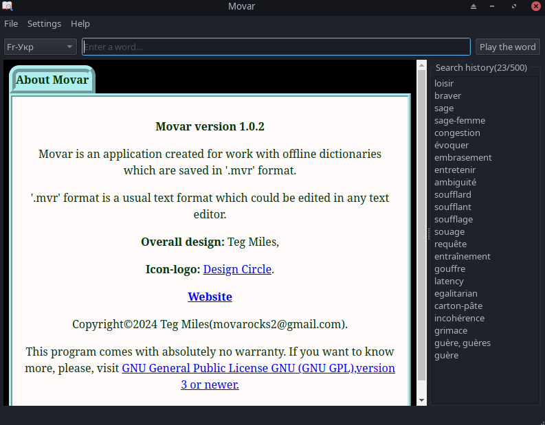

About Movar application
========================

Screenshots
===========

Description
===========

This program created for offline working with linguistic dictionaries.

Copyright (C) 2024  Teg Miles.
Movar is free software: you can redistribute it and/or modify it
under the terms of the GNU General Public License as published by
the Free Software Foundation, either version 3 of the License,
or any later version.

Features
========

  * Provides access to properly formatted files of linguistic dictionaries.
  * Can convert separate words into sound.
  * Supports such interface languages as Ukrainian, English, Japanese.

Supported file formats
======================

  -Only .mvr format files for now. '.mvr' format is an usual text format which could be edited in any text editor.

How to use
===========

   -Scan paper dictionary and save it in '.mvr' format 
   or find already scanned and saved in .txt format dictionary 
   and change it's extension form txt to mvr. 
   mvr is an usual text format, which could be edited 
   in any text editor. It was created for separation 
   Movar dictionaries from other text files.

   -Edit first four rows of the dictionary file as described below:
        * First row — Title of yours dictionary
        * Second row — Language pair, for example Eng-Eng
        * Third row — Brief description of the dictionary
        * Fourth row — Pattern from Regular Expressions for filtering terms from the dictionary,
        		which must meet demands of Qt RegularExpression.
        It's a condition of the Regex engine used in this version of the app. 

   -Go to the Settings and choose folder with the file.
        
   You can find example of the formatting in the file called Webster dictionary(Gutenberg.org).mvr,
   which located in the folder named Webster dictionary.

   This application outputing a dictionary article through QWebEngineView.
   Therefore you could use a HTML markup language for formatting yours dictionaries files.

Authors
========

  - Teg Miles (movarocks2@gmail.com)
  - The logo icon was taken from `this place https://www.flaticon.com/free-icon/dictionary_7793703?term=dictionary&page=3&position=77&origin=tag&related_id=7793703`_.

Requirements
============

* Qt6 (6.6.1 or newer), CMake (3.5 or newer), C++ compiler (GCC, Clang or MSVC), flite or speechd (optional).

One of the following operating systems:

* **Microsoft Windows**: 64-bit Windows 10 or higher
* **Linux**: x86_64 with kernel 5.15.0 or higher.  *Manjaro 23.0.0 (or newer) recommended.*

Configuration
=============

Configuration for the application is stored in the ``Movar.conf`` file or registry item
in a directory appropriate to your OS.  Refer to this table:

System     Directory
========================================================
Linux, BSD ``$XDG_HOME/`` if defined, else ``~/.config/``
Windows    ``\HKEY_CURRENT_USER\Software\Movar``

General notes
=============

  - The more dictionaries you will add to the app, the slower it will be downloading at start.
  - For faster searching through dictionaries better to create separate groups of dictionaries.
